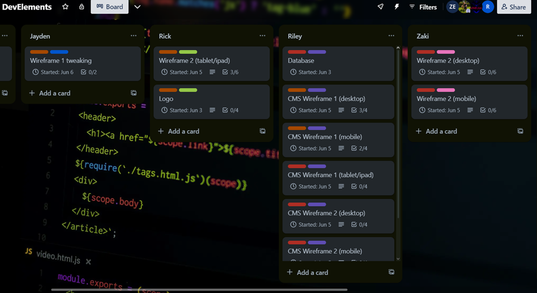

# Plan van aanpak

## 1. Onderzoeksvragen:

Onderwerpen verzinnen en onderzoeken. Beschrijf een onderwerp waar je
naar wilt gaan kijken zoals bepaalde functies, libraries, layouts,
persoonlijke vragen:

1.  In welke regio’s werkt Hendrik?
2.  Hoeveel kost het je om zijn diensten in te huren, en op basis
    waarvan berekent hij de kosten?
3.  Heeft hij externe links die hij graag in zijn website wil hebben
4.  Heeft hij certificaten en kunnen we die in een tabje in de website
    presenteren
5.  Zijn er nog andere dingen waar we rekening mee moeten houden met de
    website, bijvoorbeeld als hij nog dingen wil kunnen verkopen op zijn
    website of dat er een makkelijke manier is om met hem in contact te
    komen
6.  Moet er een CMS komen om de diensten, etc. In te kunnen toevoegen,
    bewerken en verwijderen?
7.  Heeft Hendrik al een design op ogen? En zo ja, hoe ziet dat eruit?
    Kan hij een schets ervan leveren?
8.  Login/Signup functie?
9.  Validatie PHP (denk aan validatie persoongegevens)
10. Security risks oplossen zoals PHP PDO gebruiken, password hashing,
    anti-sql injection

## 2. Overzicht producten:

1.  Verbouwen van een tuin (Hekken maken, spullen neerleggen of aankopen
    afleveren)
2.  Grasmaaien (tussen 1 tot 10 uur (GEEN AVOND WERK!))
3.  Heggen snoeien (Tussen 1 tot 12 (GEEN NACHT WERK!))
4.  Stoep schoonspuiten (Ik gebruik een pressure washer om de stoep en
    looppad op te schonen)
5.  Onkruid uitwieden (tussen 1 tot 10 (GEEN AVOND/NACHT WERK!)
6.  De aanleg van gazons of kunstgras
7.  Het aanleggen van sedumdaken
8.  Het plaatsen van tuinhuisjes

## 3. Activiteitenoverzicht:

Er zullen meerdere wireframes zijn met kleur en het zal gepresenteerd
worden om 14 juni 2024 vervolgens zullen we de opties naar onze op het
moment baas en kijken wat hij ervan vindt en zijn uiteindelijke keuzen.

## 4. Organisatie en taakverdeling:

Jayden zal wireframe 1 gaan maken, Zakaria en Rick maken wireframe 2 en
Riley maakt 2 CMS wireframe's.

Jayden en Rick maken de footer en Header, Zakaria maakt de main terwijl
Riley de database voor ons in elkaar zet.

## 5. Risicoanalyse:

Als iemand te laat is zal diegene zelf gewoon zijn taak op zich moeten
nemen.

Bij ziekte probeert die persoon thuis in ieder geval iets te doen, maar
als dat niet lukt zal iemand anders een taak van die persoon overnemen.

## 6. Planning projectgroep:

Wat iedereen moet doen is te vinden op ons Trello board, vraag aan 1 van
onze team leden om een screenshot wanneer u dat nodig heeft.

